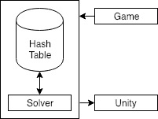

# AllQueens
_Produced by Anthony Ling_

_All major art assets (3D models, libraries with except the 5-by-5 board which was modified from the original chessboard) were taken from [here.](https://www.raywenderlich.com/5441-how-to-make-a-chess-game-with-unity.)_

_Scripts were created by myself._

## Purpose
This project is intended to create a solver for the game [AllQueensChess.](https://www.thinkfun.com/products/all-queens-chess/ "AllQueensChess")

There also contains a Unity version of the game in the [Unity](https://github.com/Ant1ng2/FourQueens/tree/master/Unity) folder for future use.

  

## Game
This game follows the rules of regular chess with the following exceptions:
* This game is played with a 5-by-5 board and 12 Queens, 6 Queens are controlled by each player.
* There are no captures.
* The win condition is to line 4 Queens of a players color in a row, meaning horizontally, vertically, and diagonally.

## Contents
There are three folders:
* Unity: Contains all the assets and scripts for the Project
* Solver: Python3 Script for Game and Solver (still in development)
* Build: Contains builds for the Unity demo
